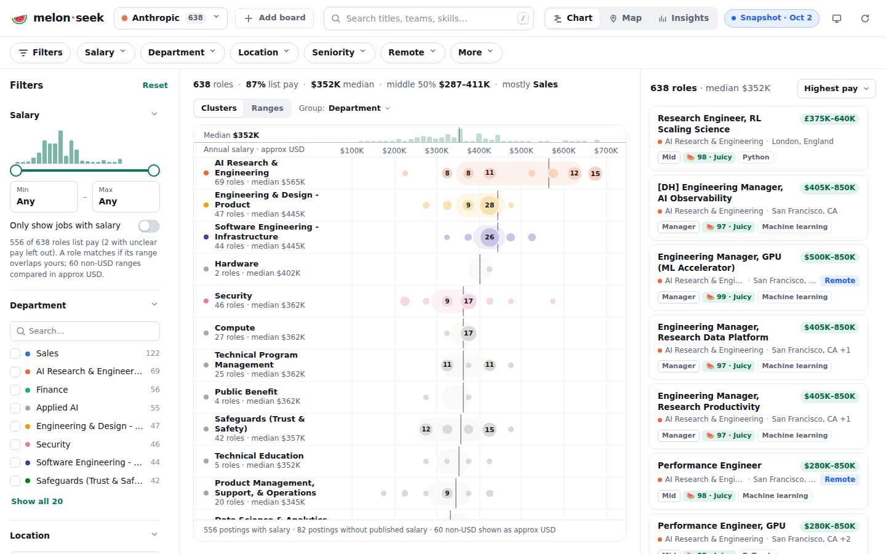
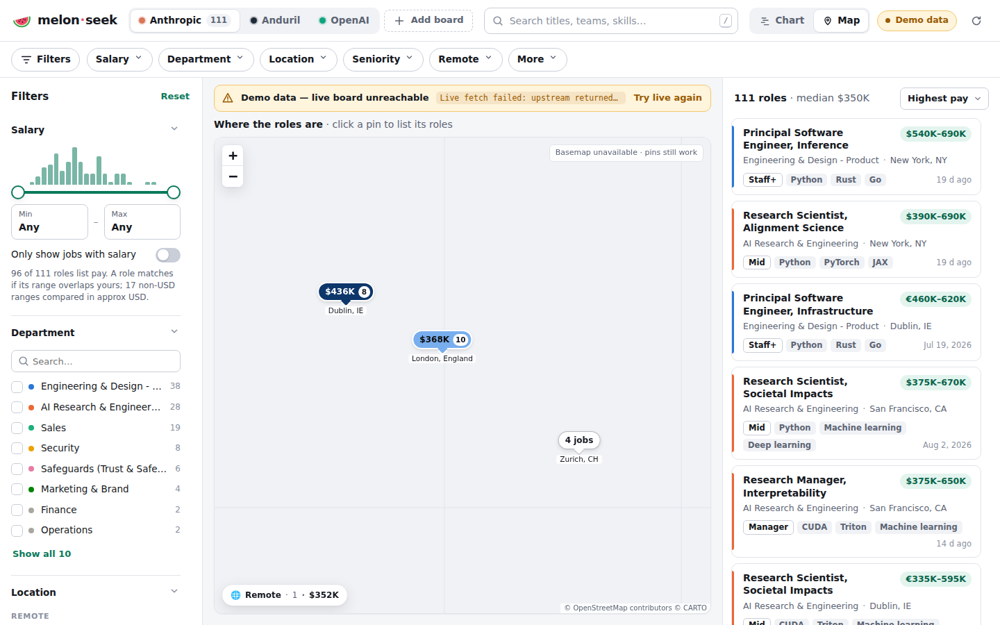

# melon-seek

**Zillow for job postings.** Pick a company, and melon-seek pulls its public job
board and plots every posting the way a real-estate site plots listings: by
price (salary), by neighbourhood (location), and by features (skills,
responsibilities, fit).

- **Chart mode (default)** — every job is a horizontal min–max salary bar on a
  shared salary axis, sorted by midpoint and optionally grouped/coloured by
  department, location or seniority. Hover for details, click to open the job.
- **Map mode** — Zillow-style price-tag pins per city (`$352K · 12`), clustered
  by location, with remote roles collected in a separate "Remote" badge.
- **Zillow-like filters** — salary range, responsibilities, fit / requirements,
  skills keywords, department, location, seniority. Filter and view state lives
  in the URL hash, so any view is shareable.
- **Company switcher** — built-in Anthropic, Anduril and OpenAI, plus
  **Add board** for any custom Greenhouse, Ashby or Lever board slug.

Zero build step, Node >= 18, one runtime dependency (`leaflet`).

## Screenshots

<!-- Images to be added by the project lead. -->

| Chart mode | Map mode |
| --- | --- |
|  |  |

## Quick start

```sh
npm install && npm start
# open http://localhost:5173
```

`npm run dev` restarts the server on file changes (`node --watch`). Set `PORT`
to change the port (default `5173`).

With Docker:

```sh
docker build -t melon-seek .
docker run --rm -p 5173:5173 melon-seek
```

## Data modes

Every `/api/jobs` response carries a `mode` telling you where the data came from.
The server tries, in order:

| Mode | Source | When |
| --- | --- | --- |
| `cache` | In-memory / disk cache (`data/cache/`) | A fetch younger than 30 minutes exists. Stale disk cache is also used if the live fetch fails. |
| `live` | The company's public job board API | Cache missing or expired (or `?refresh=1`). |
| `snapshot` | `data/snapshots/<slug>.json` | Live fetch failed and no disk cache exists. |
| `demo` | Synthetic, deterministic jobs from `server/demo.js` | Nothing else is available (e.g. boards unreachable, offline sandbox). |

**Demo data is fake.** It exists so the whole pipeline (salary parsing, geo,
keywords, chart, map) can be exercised offline. The API marks it
`mode: "demo"` and the UI labels it clearly; it is never presented as a real
posting.

### Snapshots

```sh
npm run snapshot                              # every built-in in server/companies.js
npm run snapshot -- anthropic anduril openai  # explicit list
npm run snapshot -- lever:acme                # custom board as <source>:<board>
```

Only live data is ever written; if a fetch fails (or returns 0 jobs) the
existing snapshot is kept, and demo data never ends up in `data/snapshots/`.

This fetches live data and writes `data/snapshots/<slug>.json`. The server
uses these as its offline fallback, and the static build bundles them.

**Snapshots are not committed to git.** `data/snapshots/*.json` is gitignored.
Real boards are big (one day's set is ~74 MB; `anduril.json` alone is ~38 MB),
and committing them daily would add that much to the repo's history every day,
for data that's stale within hours. Instead:

- The [`snapshot` workflow](.github/workflows/snapshot.yml) runs daily on GitHub
  Actions, whose runners can reach the boards. It uploads `data/snapshots/` as
  the workflow artifact **`job-board-snapshots`**, kept for 14 days.
- The [`pages` workflow](.github/workflows/pages.yml) restores the newest
  artifact, then fetches fresh data. A board that fails during that run keeps
  its last good snapshot instead of dropping to demo data.
- Both workflows run the **salary vetting gate** (`node scripts/vet-salaries.js`)
  after fetching. It exits 1 when a job whose salary would be shown has a
  critical anomaly (an implausible amount), or when a regression fixture fails.
  - In `pages.yml` it's a **hard gate**: no existence guard and no
    `continue-on-error`. A non-zero exit skips the build and the deploy, so
    implausible pay is never published. Its flags report is kept as the
    `salary-vetting` artifact.
  - In `snapshot.yml` it fails the run, but the snapshots artifact is still
    uploaded for review.
  - Flagged jobs are listed in the run's summary.
- A fresh clone has no snapshots and shows demo data (clearly labelled) until
  you run `npm run snapshot` on a machine with internet access. You can also
  download a recent artifact:
  `gh run download --repo alvations/melon-seek --name job-board-snapshots --dir data/snapshots`.

### History ledger (listing age, freshness, reposts)

`npm run snapshot` also records each successful fetch in a per-company **ledger**,
`data/history/<slug>.json` (`server/history.js` and `scripts/history.js`). It
tracks when each posting was first seen, when it closed, and reposts (a new id
for the same role). The UI's "Listed N days ago", the freshness filter and the
repost details all come from it.

The ledger is only useful if it survives between runs, so the workflows persist
it. Like snapshots, it is never committed to `main` (`data/history/` is
gitignored). There are two stores, chosen by the repository variable
**`HISTORY_STORE`**:

| Store | How it works | Caveat |
| --- | --- | --- |
| `artifact` **(default)** | Both workflows restore the newest non-expired **`history-ledger`** artifact (from either workflow), run the snapshot, which updates the ledger, and upload it again with **90-day retention**. No artifact means start fresh. | If no workflow runs for 90 days, the chain breaks and the ledger starts over. Two overlapping runs: the last upload wins. |
| `branch` | The same restore and update, but the ledger is read from, and committed to, an **orphan `data-history` branch** as `history/<slug>.json`. A separate `persist-ledger` job does the commit. It's the only job with `contents: write`, and it's skipped in artifact mode. | Durable and auditable. Needs the user's OK (ROADMAP §9 D1). |

**Switching to the branch is one step:** Settings → Secrets and variables →
Actions → Variables → add `HISTORY_STORE` = `branch`. Nothing in the workflow
files changes: both already contain the branch steps
([`.github/scripts/ledger.sh`](.github/scripts/ledger.sh) and the
`persist-ledger` job). The first branch run seeds `data-history` from the latest
artifact, since the artifact is still uploaded on every run. Removing the
variable switches back.

To get a ledger locally, use either
`gh run download --repo alvations/melon-seek --name history-ledger --dir data/history`
or, in branch mode,
`git fetch origin data-history && git show origin/data-history:history/anthropic.json`.

## Tests

```sh
npm test   # node --test test/*.test.js
```

CI ([`ci.yml`](.github/workflows/ci.yml)) runs the tests on Node 20 and 22,
checks that the static build succeeds, and smoke-tests the running server
(`/api/companies`, `/api/jobs?company=anthropic`).

## Deploying to GitHub Pages

The app also runs without a server, as a static site at
<https://alvations.github.io/melon-seek/>.

```sh
npm run build          # -> dist/
```

`scripts/build-static.js` writes:

| Path | Contents |
| --- | --- |
| `dist/` | A copy of `public/`. Absolute `/x` URLs in the HTML become relative, so the site works under the `/melon-seek/` sub-path. |
| `dist/config.js` | Sets `window.MELON_STATIC = true`. It's loaded before `app.js`. |
| `dist/lib/` | Browser copies of the modules allowlisted in `server/lib-modules.js` (the same list the server serves at `/lib/`): `normalize`, `salary`, `vet`, `geo`, `keywords`, `demo`, `juice`, `history`, `companies` and `sources/*`. |
| `dist/vendor/leaflet/` | Leaflet. |
| `dist/api/companies.json` | The built-in companies. |
| `dist/api/jobs/<slug>.json` | The company's job list: its snapshot (`mode: "snapshot"`), or demo data if the build had no snapshot. Descriptions are left out and the list is packed (see below). Each list is kept under 1.5 MB. |
| `dist/api/cities.json` | `data/cities.json`, the Juice Score inputs (89 cities). |
| `dist/api/desc/<slug>/<id>.json` | One job's `descriptionHtml` (plus its `sections`, if they were moved out of the list), loaded when the job is opened. |
| `dist/api/demo/<slug>.json` | Demo data (`mode: "demo"`). Only written when the main list is a real snapshot. |
| `dist/api/history/<slug>.json` | The compact ledger, `{ id: [firstSeenAt, postedAt, repostCount, repostFirstSeenAt?] }` (open postings; `server/history.js#compactLedger`). It's `{}` when there's no ledger. `api.js` merges it into jobs fetched live in the browser. |
| `dist/api/meta/<slug>.json` | The list's `meta`: `{ compstimate, history }`. Live browser fetches reuse it. |
| `dist/api/market.json` | Market comps ("same role elsewhere"), from `scripts/build-market.js`. Vetted base-pay ranges only, ≤ 150 kB. |
| `dist/data/<slug>.csv`, `dist/data/README.txt` | **Open data**: one CSV per company with real data (no descriptions), plus a README covering the columns and attribution. Demo-only companies aren't exported. |
| `dist/.nojekyll` | Turns off Jekyll processing. |

Each list also carries `meta`:
- `meta.compstimate` is the seeded leave-one-out backtest of Compstimate
  (`backtest()` in `public/features/compstimate.js`, seed 20261002, up to 500
  jobs, percent values). It's null for demo data.
- `meta.history` is `{ since, runs }` from the ledger.

The Pages run's summary shows both for every company.

**Keeping bundles small.** Description HTML is about 90% of a job's bytes; on
real data, the lists were 7–10 MB for the biggest boards with descriptions
inline. The build makes three changes:

1. Each description goes in its own `api/desc/...` file. The app calls
   `getJobDetail(job)` from `public/api.js` when you open a job, so the HTML is
   fetched once per job you open and then cached.
2. Lists use a lossless packed format (`melon-packed-2`):
   - company fields, the id prefix and the shared URL prefix are stored once;
   - repeated locations, keyword labels and departments become indexes into a
     shared dictionary;
   - fields that every job carries (`postedAt`, `firstSeenAt`, `ageDays`,
     `freshness`, `repost`, `extras`, …) are stored once per list as columns;
   - exact ISO timestamps become epoch milliseconds;
   - salary and keywords become value tuples.

   `public/api.js` unpacks them back into normal Job objects, and still reads
   the older `melon-packed-1`. The build checks that every job round-trips
   exactly, including every v2 field, and fails if one doesn't.
3. If a list is still over 1.5 MB, that company's `sections` (the
   responsibilities/fit bullets) also move into the desc files. Keywords stay in
   the list, so filters work immediately.

The build prints each company's list size and description total. On real data
(Oct 2026) every list is under 1.5 MB; the largest is Anduril, with 2,418 jobs
in 1.3 MB.

**Juice Score.** `public/api.js` computes each job's `juice` (what's left of the
salary after tax, rent and living costs; see [docs/LIVABILITY.md](docs/LIVABILITY.md))
in the browser, in both server and static mode. Every `getJobs` result goes
through the salary gate (`vetSalaries`), then `attachJuiceAll` with the cities
from `getCities()`. Juice is never stored in the bundled lists. If the cities
can't be loaded, jobs get `juice: null` and no error is shown.

In static mode, `public/api.js` runs the fallback chain in the browser:

1. A live fetch from the board, using the same adapters and normalizer as the
   server.
2. The bundled snapshot.
3. The bundled demo data.
4. Demo data generated in the browser.

Custom boards try the live fetch and otherwise show demo data. Browsers only
allow cross-origin requests when the board API permits them:

- **Greenhouse** is built for client-side use, so live fetches are attempted.
- **Ashby** is attempted too, but its API is reported not to allow cross-origin
  requests.
- **Lever** is attempted. Its docs say cross-origin requests from other sites
  aren't supported, though it currently returns `Access-Control-Allow-Origin: *`.
  Because that failure is expected, a Lever board whose live fetch is blocked
  falls back to the bundled snapshot **without an error banner**.

When a live fetch fails, the bundled snapshot is shown. After a network or CORS
failure, that source isn't retried for the rest of the session unless you click
Refresh. Demo fallbacks always show why they're demo data.

The [`pages` workflow](.github/workflows/pages.yml) fetches fresh snapshots for
every built-in company in `server/companies.js` before each build, after first
restoring the latest `job-board-snapshots` artifact as a fallback. It runs on
pushes to `main` and `claude/stoic-ride-54ddxp`, on manual dispatch, and
daily. The run's summary page lists each company's mode, job count, list size
and description size.

Preview locally by serving `dist/` under the same sub-path, so relative URLs
resolve the way they do on Pages.

**One-time setup on GitHub:**

1. **Settings → Pages → Build and deployment → Source: "GitHub Actions".**
2. To deploy from a branch other than the default (e.g.
   `claude/stoic-ride-54ddxp`), allow it under **Settings → Environments →
   github-pages → Deployment branches and tags**. By default the
   `github-pages` environment only accepts the default branch, and the deploy
   job fails with a protection-rule error.

### Link previews (LinkedIn, Facebook, Slack, X)

`public/index.html` carries static Open Graph and Twitter card tags; crawlers
don't run JavaScript. The share image is
[`public/og/melon-seek-og.png`](public/og/melon-seek-og.png) (1200×630). Its
source is `public/og/card.html`, rendered by `scripts/build-og.mjs` with
Playwright from outside the repo; the PNG is committed, so deploys need no
browser. In server mode the tag URLs stay relative. The static build makes
`og:url`, `og:image` and `twitter:image` absolute using `SITE_URL` (default
`https://alvations.github.io/melon-seek/`; override it with the `SITE_URL`
repository variable). The build also writes a share page per company,
`c/<slug>/` (for example `…/melon-seek/c/anthropic/`). Each one has its own
title, such as "Anthropic jobs by salary · 638 roles · median $352K", and
opens the app with that company selected.

Platforms cache previews, so after a deploy that changes them:

- **LinkedIn** caches for about 7 days. Re-scrape with
  [Post Inspector](https://www.linkedin.com/post-inspector/) by pasting the
  URL and clicking *Inspect*. Posts made before that keep their old preview.
- **Facebook/Meta**: use the
  [Sharing Debugger](https://developers.facebook.com/tools/debug/) and click
  *Scrape Again*.
- **X, Slack, Discord**: there's no public refresh tool. Share the URL with a
  query string such as `?v=2`.
- **Telegram**: send the link to @WebpageBot.

Wait about 10 minutes after a deploy before re-scraping, because Pages' CDN
caches HTML. Details, verification commands and other platforms are in
[docs/process/social.md](docs/process/social.md).

## API reference

### `GET /api/companies`

```json
[{ "slug": "anthropic", "name": "Anthropic", "source": "greenhouse", "board": "anthropic", "color": "#d97757" }]
```

Built-ins: `anthropic` (greenhouse/`anthropic`), `anduril`
(greenhouse/`andurilindustries`), `openai` (ashby/`openai`).

### `GET /api/jobs`

| Query | Meaning |
| --- | --- |
| `company=anthropic` | A built-in company. |
| `source=greenhouse\|ashby\|lever&board=<slug>[&name=Display]` | A custom board. |
| `refresh=1` | Bypass the fresh cache and fetch live. |

Response:

```js
{
  company: { slug, name, source, board, color },
  mode: "live" | "cache" | "snapshot" | "demo",
  fetchedAt,               // ISO timestamp
  error: string | null,    // why live failed, if it did
  jobs: Job[]
}
```

`Job`:

```js
{
  id: "anthropic:4012345",
  company: "anthropic", companyName: "Anthropic",
  title, department, team, employmentType,
  seniority: "Intern"|"Entry"|"Mid"|"Senior"|"Staff+"|"Manager"|"Director+",
  locations: [{ name: "San Francisco, CA", city: "San Francisco", region: "CA",
                country: "US", lat: 37.77, lng: -122.42, remote: false }],
  remote: boolean,
  salary: { min: 300000, max: 405000, mid: 352500, currency: "USD",
            interval: "year", text: "$300,000—$405,000 USD" } | null,
            // min/max are annualized (hourly × 2080, monthly × 12)
  url, updatedAt,
  descriptionHtml,
  sections: { responsibilities: [string], fit: [string] },
  keywords: { responsibilities: [string], fit: [string], skills: [string] }
}
```

Errors: `400` for a missing/invalid `company`, `source` or `board`; `404` for an
unknown built-in company.

### Static

- `/` → `public/`
- `/vendor/leaflet/*` → `node_modules/leaflet/dist/*`

## Project layout

```
server/index.js            HTTP server (static + API)
server/companies.js        company registry + custom-board validation
server/sources/            board adapters: greenhouse.js, ashby.js, lever.js (+ util.js)
server/normalize.js        raw job -> Job (salary, geo, keywords)
server/salary.js           salary text parsing + annualizing
server/geo.js              location strings -> coordinates (built-in gazetteer)
server/keywords.js         responsibilities/fit sections, keyword facets, seniority
server/cache.js            memory + disk cache (data/cache/, gitignored)
server/demo.js             synthetic offline demo jobs
scripts/snapshot.js        npm run snapshot -> data/snapshots/*.json
scripts/build-static.js    npm run build -> dist/ (GitHub Pages bundle, gitignored)
public/                    index.html, styles.css, app.js (state, filters, list, drawer)
public/api.js              data access: server API, or static mode (live -> snapshot -> demo)
public/viz/                palette.js, chart.js, map.js
test/*.test.js             node --test
docs/                      CONTRACT.md, ARCHITECTURE.md, ADDING_A_BOARD.md
```

More detail: [docs/ARCHITECTURE.md](docs/ARCHITECTURE.md) ·
[docs/ADDING_A_BOARD.md](docs/ADDING_A_BOARD.md) ·
[docs/CONTRACT.md](docs/CONTRACT.md).

## Data sources

All data comes from public, unauthenticated job-board APIs that the companies
themselves publish for embedding their careers pages:

| Source | Endpoint |
| --- | --- |
| Greenhouse boards API | `https://boards-api.greenhouse.io/v1/boards/{board}/jobs?content=true` |
| Ashby posting API | `https://api.ashbyhq.com/posting-api/job-board/{board}?includeCompensation=true` |
| Lever postings API | `https://api.lever.co/v0/postings/{board}?mode=json` |

`openai.com/careers/search` is backed by the Ashby board `openai`.

### Responsible use

melon-seek only reads public endpoints, sends an identifying `User-Agent`, and
caches each board for **30 minutes** (memory + disk) so normal browsing makes at
most one request per board per half hour. Please keep it that way: don't lower
the cache TTL or poll boards in a loop. Postings belong to the respective
companies; always apply via the original posting URL.
