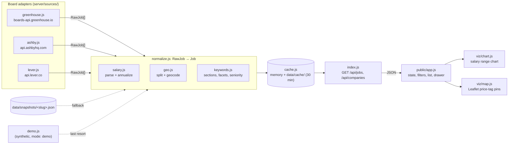

# Architecture

melon-seek is a single zero-build Node process: a tiny HTTP server that serves
`public/` as static ES modules and exposes a JSON API. The authoritative
interface definitions live in [CONTRACT.md](CONTRACT.md); this page explains how
the pieces fit together.

## Data flow

## Request lifecycle (`GET /api/jobs`)

1. `companies.js#resolveCompany` turns `?company=` or `?source=&board=` into a
   company record (built-in or custom; slugs are validated).
2. **Fresh cache** (< 30 min) → respond with `mode: "cache"`.
3. Otherwise **live fetch** via the adapter for `company.source`, normalize every
   raw job, store in cache → `mode: "live"`. `?refresh=1` skips step 2.
4. If live fails: **stale disk cache** → `mode: "cache"`, then
   **snapshot** `data/snapshots/<slug>.json` → `mode: "snapshot"`, then
   **demo** jobs → `mode: "demo"`. The failure reason is returned in `error`.

## Normalization

- **Salary** (`salary.js`): structured compensation from the source wins
  (Ashby compensation, Greenhouse pay ranges); otherwise salary text in the
  description is parsed (`$320,000—$405,000 USD`, `$310K – $385K`, `£95k-£120k`,
  `€80.000 - €100.000`, `$60/hr`). Values are annualized; `mid = (min+max)/2`.
- **Geo** (`geo.js`): raw location strings are split (`"SF | NYC"`) and matched
  against a built-in gazetteer of tech hubs, US states and countries. Remote
  entries become `{ remote: true }` locations; unknown places keep `lat/lng: null`.
- **Keywords** (`keywords.js`): description HTML is segmented into
  responsibilities and fit/requirements bullet lists, which (with title and
  department) are mapped to short facet labels — skills (`Python`, `PyTorch`),
  responsibilities (`Model training`), fit (`PhD`, `5+ yrs`). Seniority is
  inferred from the title.

## Frontend

`public/app.js` owns all state (company, chart/map mode, filters) and mirrors it
in `location.hash`. It fetches `/api/jobs`, computes facet counts, applies
filters, and pushes the filtered list into the chart and map modules, which are
pure renderers with `update / highlight / destroy` interfaces. Leaflet is served
locally from `node_modules` at `/vendor/leaflet/`; the map degrades to a plain
background if tiles can't load.

## Operations

- **Docker**: `node:22-alpine`, production deps only, runs as `node`, health
  check on `/api/companies`.
- **CI** (`.github/workflows/ci.yml`): Node 20/22 matrix, `npm test`, a check
  of the static build (`npm run build`), and a smoke test that boots the server
  and checks the API with `jq`.
- **Snapshots** (`.github/workflows/snapshot.yml`): daily `npm run snapshot`
  on GitHub runners. `data/snapshots/*.json` is uploaded as the 14-day artifact
  `job-board-snapshots` and **not committed**: one day's real snapshots are
  ~74 MB, too much to add to git history daily. Locally, `data/snapshots/` is
  gitignored.
- **GitHub Pages** (`.github/workflows/pages.yml`):
  1. Restore the latest snapshot artifact.
  2. Fetch fresh snapshots.
  3. Run `npm run build`, which writes packed job lists without descriptions,
     plus one description file per job, loaded on demand by
     `public/api.js#getJobDetail`.
  4. Deploy to `https://alvations.github.io/melon-seek/`.

  In the browser, `public/api.js` runs the live → snapshot → demo fallback
  chain itself.
